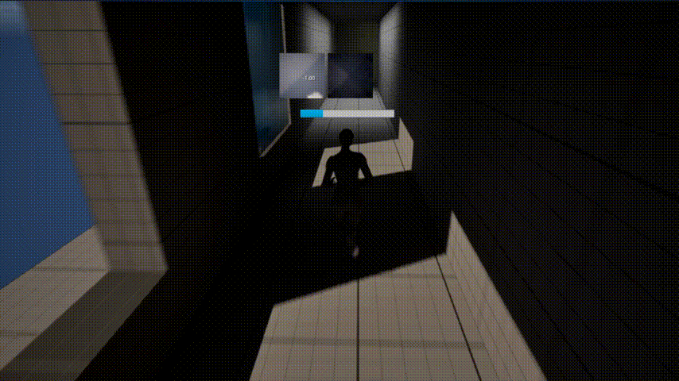
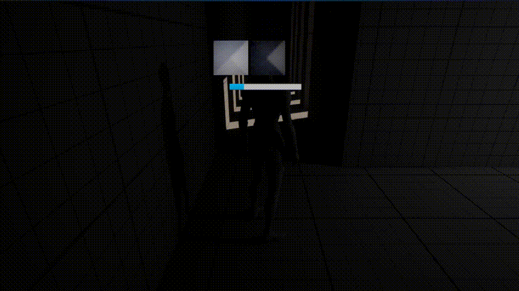
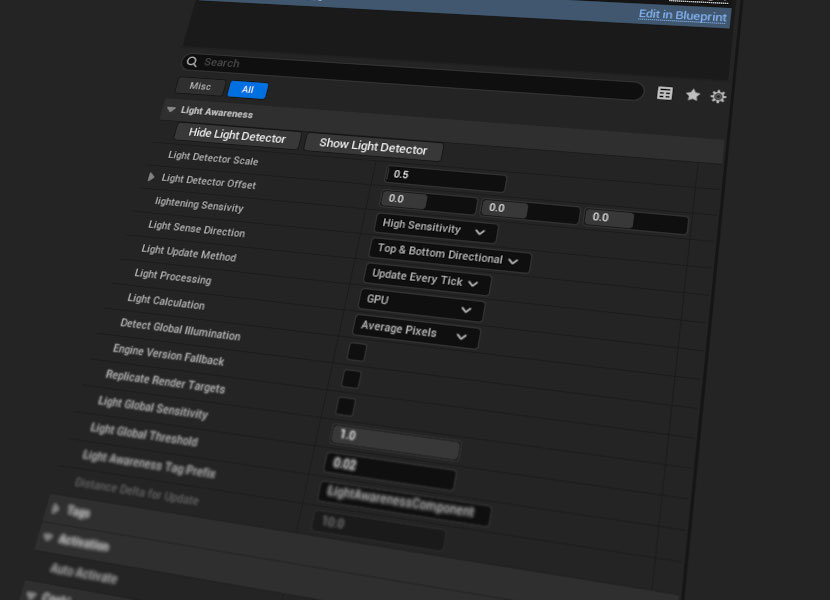
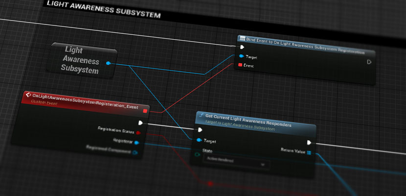

# Light Awareness Plugin

## Overview

Light Awareness is an Unreal Engine plugin that lets any actor detect how much light it is currently exposed to regardless of light type, global illumination, or post-effects.

The component captures a small scene buffer, processes pixels (CPU or GPU), and returns a brightness value that can be used for stealth mechanics, AI awareness, dynamic material effects, and more.

You can define the processing method and efficiency on the component and on the blueprint level depending on the usage.  
You can define your own rules in Blueprints or C++ to get light status from the component, or you can get the buffer image array on tick to process further calculations in Blueprint or C++.

If you are trying to integrate this component on a custom class, integrate on a parent that is Actor or simply create an Actor with the LightAwareness component and attach it to your character.

A demo with a network-enabled plugin in action can be found below.  
[Light Awareness Demo UE5 Project](https://github.com/cem-akkaya/LightAwarenessDemo)

If you have any bug or crash, please open an issue in the GitHub repo.  
If you have suggestions, questions or need help, you can always contact [me](https://github.com/cem-akkaya)

If you want to contribute, feel free to create a pull request.

---

## Features

- Detection of light status on any actor.
- Choice between **CPU or GPU** processing modes.
- Configurable **luminance weights** (Rec.709, average, or custom).
- Light detection sensitivity and optimization methods.
- Light detection direction choice for incoming sources.
- Lumen and global illumination support.
- Ability to integrate into any actor at runtime.
- Ability to get light and buffer pixels from Blueprints.
- Subsystem for accessing light status data and update events.
- Integrated update methods for distance-based usage.
- Debug views and light thresholds for your game’s global lighting conditions.

---

## Examples

|  |  |
|:--:|:--:|
| A room with soft spotlight sources showing accuracy and responsiveness. | Directional light and soft point light example. |

|  |  |
|:--:|:--:|
| Direct light pass beams showing accuracy and responsiveness. | A big soft light showing increments of light and global illumination. |

|  |
|:--:|
| Multiple sources with high sensitivity, omnidirectional detection with per-tick calculations. |

|  |
|:--:|
| Multiple moving sources with different colors demonstrating luminance accuracy between sources. |

---

## Installation

Install it like any other Unreal Engine plugin.

- Download and place the LightAwareness plugin under:  
  `Drive:\YOURPROJECTFOLDER\Plugins\LightAwareness`
- Activate the plugin in your project Plugins window.
- Add the **LightAwareness** component to your actor.
- Drag from the component pin to access functions.

---

### Installation for UE 5.3 and Below

If you are using UE versions older than 5.4 and encounter material loading errors:

- Download [this content](https://www.cemakkaya.com/FileHost/LightAwarenessContentFallback.zip)
- Overwrite into:  
  `Drive:\YOURPROJECTFOLDER\Plugins\LightAwareness\Content`
- Rebuild your project and re-enable the plugin if needed.

## Quick Start

1. Add a **LightAwareness** component to your actor.
2. Adjust **Scale**, **Direction**, and **Sensitivity** in the Details panel.
3. Call **Get Light Status** in Blueprint or C++, or bind to the event:  
   `OnLightAwarenessComponentUpdated`

---

## Component Details

- Add the **LightAwareness** component to your actor.
- Define the detector scale and offset.
- Define sensitivity and processing method.
- Call **Get Light Status** for manual sampling.
- Use the Subsystem for large-scale or event-driven access.
- **Engine Versions below 5.4 should enable Engine Version Fallback**.

---

## Component Parameters

### Scale & Offset

**Light Detector Scale**  
Defines the size of the invisible detection gem mesh.  
Larger scale captures a wider sample of surrounding light.

**Light Detector Offset**  
Shifts the detector relative to the owning actor.  
Useful for characters (e.g., placing the detector above the head).

---

### Sensitivity

- **Optimized** – balanced performance and accuracy (8×8 buffer).
- **Low** – fastest but coarsest (4×4 buffer).
- **High** – slowest but most detailed (16×16 buffer).

Controls how many pixels are sampled from the render target.

---

### Direction

- **Top** – captures light from above.
- **Bottom** – captures light from below.
- **Both** – captures both directions for maximum accuracy.

Useful if you care about GI, floor bounce, or overhead lighting.

---

### Update Method

- **Manual** – updates only when explicitly requested.
- **Distance** – updates when the actor moves beyond a threshold.
- **Every Frame** – updates every tick (highest cost).

Choose based on performance vs responsiveness.

---

### Light Processing

- **CPU** – synchronous, simple, best for few actors.
- **GPU** – asynchronous compute + readback, best for many actors, one-frame delay.

GPU mode is the recommended default for large-scale usage.

---

### Light Calculation

- **Brightest Pixel** – selects the brightest pixel in the buffer.  
  Best for stealth and spotlight detection.

- **Average Pixels** – averages all pixels.  
  Best for ambient light estimation.

---

## Light Awareness Subsystem

- Access the LightAwareness GameInstance Subsystem from Blueprints.
- Provides events when components register, unregister, or update.
- Query current responders and their rendering state.
- Components automatically unregister when destroyed or streamed out.
- Visibility status depends on the actor having at least one mesh component.
- No tracing is used internally for performance; external tracing can be added if needed.

---

## Recent Engine Update Notes (5.4+ / 5.7)

Recent versions introduce a high-fidelity fallback rendering path designed to improve lighting accuracy across engine versions and complex lighting setups.

### Perspective Fallback Rendering (Engine Version Fallback)

- Uses a **MainView SceneRenderer path** instead of the independent SceneCapture render family.
- Ensures correct **point light and spot light shadows**, **Lumen GI**, and prevents **light bleeding through walls**.
- Uses a fixed `MainViewResolutionDivisor = 20` giving ~95% lower resolution than the main view for high accuracy at low cost.

## FAQ

<b>From which gameplay objects can I get light status?</b>

From any object existing in the level.  
If you didn't attach the component, you can spawn an actor at runtime, attach the component, query light status, then destroy it.

<b>How reliable is the detection method?</b>

Depends on chosen settings.  
Default settings are reliable for most levels and stealth gameplay.  
By default 32 pixels are brute-force searched and the brightest is returned each update.  
For ambient-only use, Top direction mode is recommended for performance.

<b>Can I get light from emissive and global illumination?</b>

Yes.  
Enable **Global Illumination** to include indirect lighting and emissive contributions.  
Note that very small capture resolutions with Lumen may show slight value jumps during extreme lighting changes.

---

## Known Limitations / Tips

- GPU processing introduces a one-frame delay (consume previous frame, enqueue next).
- Colored lights may appear weaker with perceptual luminance weights.
- Avoid **Every Frame** updates on large numbers of actors for best performance.
- **Engine Version Fallback** provides the highest accuracy but adds one reduced-resolution MainView render pass.
- Under UE < 5.4, enable Engine Version Fallback due to orthographic capture shadow limitations.

---

## License

This plugin is under the [MIT License](LICENSE).

MIT allows commercial use.  
You may use, modify, and distribute the software in commercial products without restriction, provided the original copyright notice is included.

---

## Support Me

If you like the plugin, you can support my work here:

