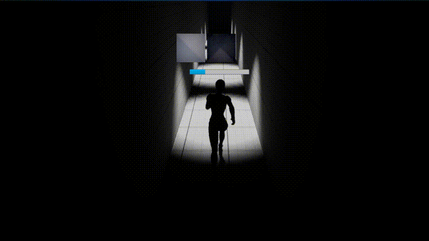
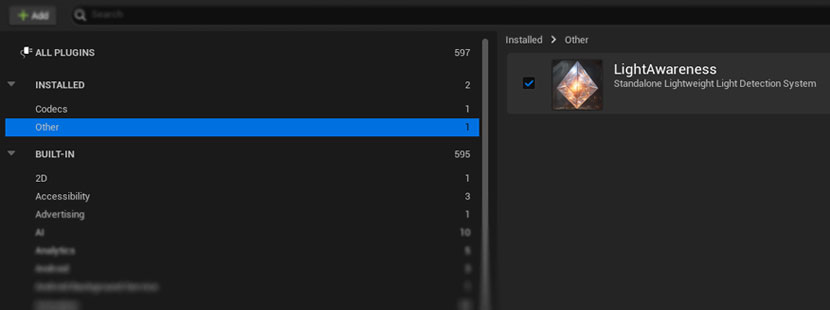
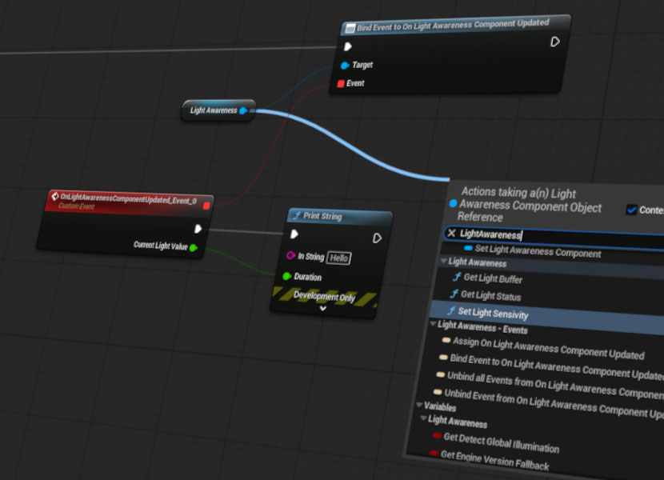

# Light Awareness Plugin

## Overview

Light Awareness is an Unreal Engine plugin that lets any actor detect how much light it is currently exposed to regardless of light type, global illumination, or post-effects.

The component captures a small scene buffer, processes pixels (CPU or GPU), and returns a brightness value that can be used for stealth mechanics, AI awareness, dynamic material effects, and more.

You can define the processing method and efficiency on the component and on the blueprint level depending on the usage.
You can define your own rules in blueprints or C++ to get light status from the component, or you can get the buffer image array on the tick to process further calculations
in blueprint or C++.

If you are trying to integrate this component on a custom class, integrate on a parent that is actor or you can just create an actor with the LightAwareness component and attach to your character.

A demo with a network-enabled plugin in action can be found below a link.
[Light Awareness Demo UE5 Project](https://github.com/cem-akkaya/LightAwarenessDemo)

If you have any bug or crash, please open an issue in the GitHub repo.\
If you have suggestions, questions or need help to use, you can always contact [me](https://github.com/cem-akkaya) 

If you want to contribute, feel free to create a pull request.

## Features
- Detection of light status on any actor.
- Choice between **CPU or GPU** processing modes.
- Configurable **luminance weights** (Rec.709, average, or custom).
- Light detection sensitivity and optimization methods.
- Light detection direction choice for incoming sources.
- Lumen and global illumination support.
- Ability to integrate into any actor on runtime.
- Ability to get light and buffer pixels from blueprints.
- Subsystem for accessing light status data and status update events.
- Integrated update methods for usage if suitable for your project as distance update.
- Debug views and light thresholds for your game's global lighting conditions.

## Examples

Some passages defined with various light sources and dark zones:

|                             |  |
|:-----------------------------------------------------------------------:|:--------------------------------------------:|
| A room with soft spotlight sources showing accuracy and responsiveness. | Directional light and soft point light example. |

|     |  |
|:-----------------------------------------------:|:--------------------------------------------:|
| Direct light pass beams showing responsiveness. | A big soft light showing increments of light and global illumination. |

## Installation

Install it like any other Unreal Engine plugin.
- Download and place the LightAwareness Plugin under: Drive:\YOURPROJECTFOLDER\Plugins\LightAwareness
- Activate the plugin in your project plugins.
- On your actor add the component "LightAwareness".
- Drag a pin from a component to see available functions.

### Installation 5.3 & Down
- If you are using older than 5.4 and get material loading errors :
- - Download [this content](https://www.cemakkaya.com/FileHost/LightAwarenessContentFallback.zip) and overwrite to Drive:\YOURPROJECTFOLDER\Plugins\LightAwareness\Content
- - Rebuild your project, disable plugin if necessary

### Quick Start
1. Add a **LightAwareness** component to your actor.
2. Adjust **Scale, Direction, Sensitivity** in the Details panel.
3. Call **Get Light Status** in Blueprint or C++ to get brightness values or simply bind to the event `OnLightAwarenessComponentUpdated`.  

## Component Details

- On your actor add the component "LightAwareness".
- Define the light gem using components scaling and offsets to your needs.
- Define sensitivity and method as you need.
- Call the "Get Light Status" function to snapshot light level on object for manual request of status.
- Call Subsystem update event for accessing light changes in large-scale environments and utilization.
- Engine Versions Under 5.2 Should use "Engine Version Fallback = true"

### Component Parameters
Below variables are exposed in the Details panel of LightAwarenessComponent. They control how the component samples and calculates light.

#### Scale & Offset
- **Light Detector Scale**
    - Defines the size of the invisible detection “gem” mesh.
    - Larger scale captures a wider sample of the surrounding light.
- **Light Detector Offset**
    - Shifts the detector relative to the owning actor.
    - Useful for characters (e.g., move detector above the head).

#### Sensitivity
- **Optimized**: balanced performance and accuracy (8×8 buffer).
- **Low**: fastest but coarsest (4×4 buffer).
- **High**: slowest but most detailed (16×16 buffer).  
  Controls how many pixels are sampled from the render target.

#### Direction
- **Top**: only captures light from above the actor.
- **Bottom**: only captures light from below the actor.
- **Both**: captures from both directions for maximum accuracy.  
  Useful if you care about GI, floor bounce, or overhead light.

#### Update Method
- **Manual**: light status only updates when explicitly requested via Blueprint/C++.
- **Distance**: updates when the actor moves more than the set threshold.
- **Every Frame**: updates every tick (highest cost).  
  Choose based on performance vs responsiveness needs.

#### Light Processing
- The component now supports both **CPU** and **GPU** based light calculations:
- **CPU**: synchronous, simpler, lower overhead for few actors.
- **GPU**: asynchronous compute shaders, better for many actors, one-frame delay.  
  This is the main processing backend.

#### Light Calculation
- **Brightest Pixel**: picks the single brightest pixel in the buffer.
    - Best for stealth/spotlight detection.
- **Average Pixels**: averages all pixels.
    - Best for smooth ambient light estimation.

### Light Awareness Subsystem

- You can access LightAwareness GameInstance subsystem from blueprints
- Subsystem provides events when an actor with component registers, unregisters, or updates its status.
- You can use this information to simply know how many light awareness responders are available at a given time in gameplay with its status as: Active or ActiveRendering
- Without the events you can simply use GetCurrentLightAwarenessResponders blueprint node to access array of components.
- You can select and filter the GetCurrentLightAwarenessResponders node with currently active responders and active being rendered state ones.
- When a component is destroyed (killed or streamed out), the component is unregistered from the subsystem.
- Visibility status depends on the actor having at least one mesh component. There are no tracing methods used on the component since it's costly, you can use additional tracing on event to determine object position or further gameplay/functionality logic.

A demo with network enabled plugin in action can be found below link.
[Light Awareness Demo UE5 Project](https://github.com/cem-akkaya/LightAwarenessDemo)

## FAQ

<b>From Which gameplay objects can I get light status? </b>

> From any object existing in the level, you can get a light status value.
> If you didn't attach the component, you can spawn an actor at location and attach the component in runtime and destroy.\

<b>How reliable is the detection method? </b>

> Depends on what settings you use to get buffer pixels and calculate them.
> Default settings are quite reliable on many levels and can be used for stealth games as well as other utilization purposes.\
> With default settings 32 Pixels are brute force searched, and the brightest pixel returned on tick.
> This is more than enough for getting an average light however, It's recommended to do top direction pass if its not needed in your game.\

<b>Can I get light from Emissive and Other sources?</b>

> Yes you can. There is a "Global Illumination" option where environmental light effects are also included in light detection.\
> However Lumen in scene renders for small image sizes can have small value jumps in extreme light condition changes.

### Known Limitations / Tips
- GPU processing introduces a one-frame delay (consume last frame, kick next frame).
- Colored lights may appear weaker with perceptual weights; switch to average or custom weights if needed.
- For best performance, avoid enabling "Every Tick" updates on a large number of actors.
- Under UE < 5.4, enable `Engine Version Fallback` due to orthographic capture issues.

## License

This plugin is under [MIT license](LICENSE).

MIT License does allow commercial use. You can use, modify, and distribute the software in a commercial product without any restrictions.

However, you must include the original copyright notice and disclaimers.

## *Support Me*

If you like my plugin, please do support me with a coffee.

